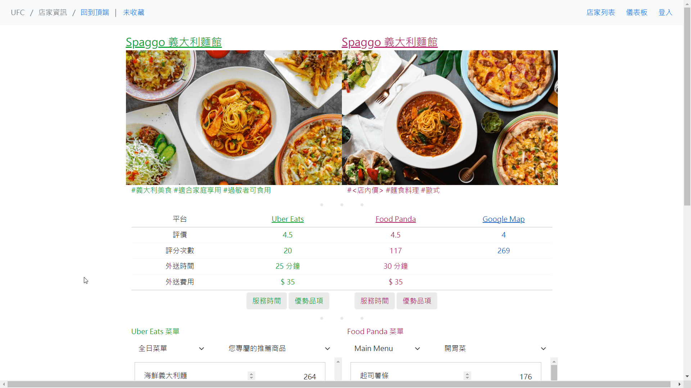

# UberEats & FoodPanda Comparison (UFC)

One stop restaurants rating comparison website for AppWorks School using information crawled from Uber Eats, Food Panda and Google Map.

Website url: https://4hsinyili-ufc.xyz

You will need an account to add restaurant into favorites, here is a test account:
* Email: test_ufc@ufc.xyz
* Password: comparethem2021

## Table of Contents
* [Technologies](##Technologies)
* [Data Pipeline](#Data-Pipeline)
* [Server Structure](#Server-Structure)
* [MySQL Schema](#MySQL-Schema)
* [Features](#Features)

## Technologies
> Data Pipeline
* AWS Cloud Watch
* AWS Lambda
* AWS Step Function
* crontab

> Backend
* Django

> Database
* MongoDB
* MySQL

> Frontend
* HTML
* CSS
* JavaScript

> Networking
* Nginx
* SSL Certificate(ZeroSSL)

> Others
* AWS EC2
* AWS RDS
* AWS S3
* Docker
* Google Place API
* Selenium

## Data Pipeline
For better resolution, please view [Original Image](https://appworks-school-hsinyili.s3.ap-northeast-1.amazonaws.com/UFC_Data_Pipeline.png).

## Server Structure

## MySQL Schema

## Features
### Dashboard
#### Diagrams:

#### Pick a range you like to see:

### Search with custom conditions

#### Search with keyword:

#### Filter restaurants:

#### Sort restaurants:

### Find Cheaper Items
#### Show items thar are cheaper on UberEats or FoodPanda.

### Shuffle
#### Shuffle restaurants if you can't decide what to eat:

#### Shuffle restaurants with conditions:

### Favorite
#### Add restaurants to your favorite:

